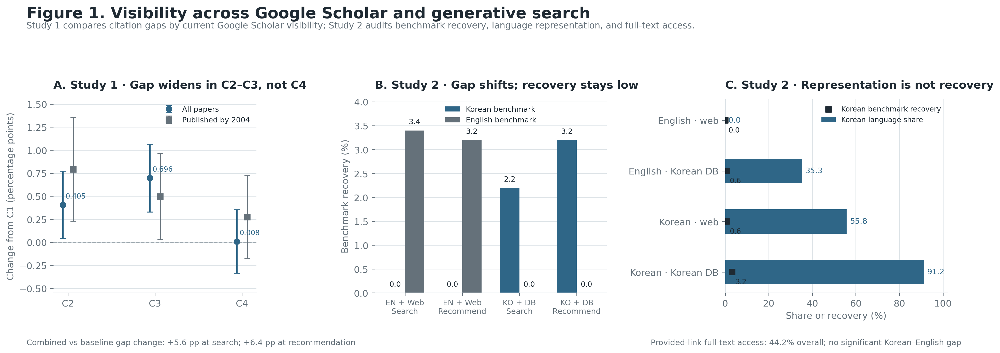

# Discovery Bottleneck: The Visibility of Korean Politics Scholarship across Google Scholar and Generative Search

Hyowon Kim, Do Won Kim, and Won-ho Park  
September 2026

## Overview

This repository accompanies a two-study manuscript on the visibility of Korean politics scholarship in contemporary search environments.

Study 1 examines 54,789 Korean-politics papers cited at least once in Korean-language political science scholarship. It assesses whether each paper is currently returned by Google Scholar and analyzes how this status is associated with English-language citation probability across publication cohorts. It also examines full-text access through links supplied by Google Scholar.

Study 2 audits two web-enabled generative search systems using 50 Korean-language and 50 English-language benchmark papers across five Korean-politics topics. The audit varies query language and instructions to search Korean scholarly databases, then measures benchmark recovery in observable search traces and final recommendations as well as full-text access through supplied links.

The studies distinguish search visibility, final source selection, and supplied-link access. The results are interpreted as evidence about discovery conditions rather than as a causal estimate of the effect of search systems on citation inequality.

## Manuscript

| Language | Markdown | Word | PDF |
|---|---|---|---|
| English | [EN manuscript](manuscript/discovery_bottleneck_combined_EN.md) | [EN Word](manuscript/discovery_bottleneck_combined_EN.docx) | [EN PDF](manuscript/discovery_bottleneck_combined_EN.pdf) |
| Korean | [KO manuscript](manuscript/discovery_bottleneck_combined_KO.md) | [KO Word](manuscript/discovery_bottleneck_combined_KO.docx) | [KO PDF](manuscript/discovery_bottleneck_combined_KO.pdf) |

## Main figure

## Repository structure

- `manuscript/` contains the English and Korean manuscripts in Markdown, Word, and PDF formats.
- `study1_cohort_final/` contains the constructed Study 1 cohort data and validation outputs.
- `study1_analysis/` contains Study 1 estimates, diagnostics, figures, and interpretation files.
- `study1_sample_validation/` contains Study 1 sample-reconstruction checks.
- `combined_analysis/figures/` contains figures used in the manuscript.
- Root-level Python and R scripts construct, validate, analyze, and visualize the Study 1 data.

## Authors

- Hyowon Kim
- Do Won Kim
- Won-ho Park

